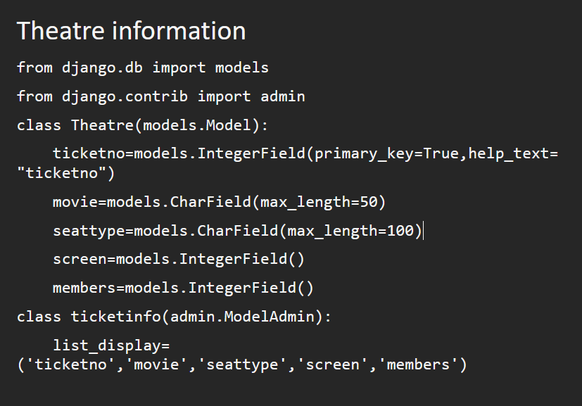
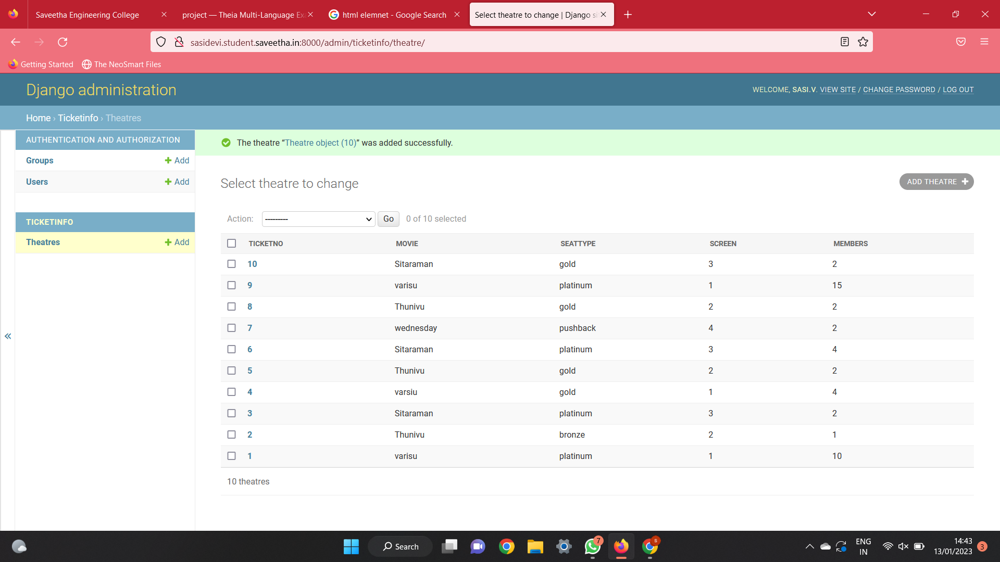

# Django ORM Web Application

## AIM
To develop a Django application to store and retrieve data from a database using Object Relational Mapping(ORM).

## Entity Relationship Diagram


## DESIGN STEPS

### STEP 1:
Clone the repository to theia ide. start a new app inside the project folder.

### STEP 2:
Type the appropriate code for your table and provide appropriate data types to the columns.

### STEP 3:
Create a report about your project in readme.md file and upload the django.orm.app folder to your remote repository.

## PROGRAM:
```
from django.db import models
from django.contrib import admin
class Theatre(models.Model):
    ticketno=models.IntegerField(primary_key=True,help_text="ticketno")
    movie=models.CharField(max_length=50)
    seattype=models.CharField(max_length=100)
    screen=models.IntegerField()
    members=models.IntegerField()
class ticketinfo(admin.ModelAdmin):
    list_display=('ticketno','movie','seattype','screen','members')
```    

## OUTPUT



## RESULT:
Thus the project is developed to have theatre tickets database.
